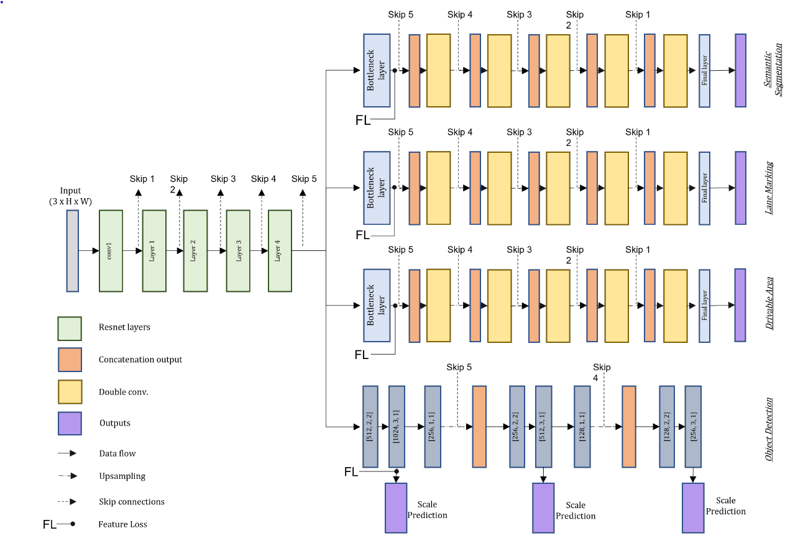
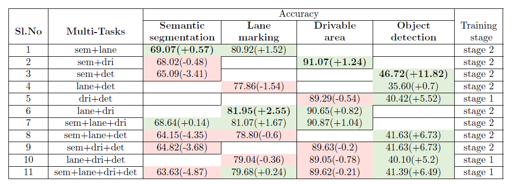
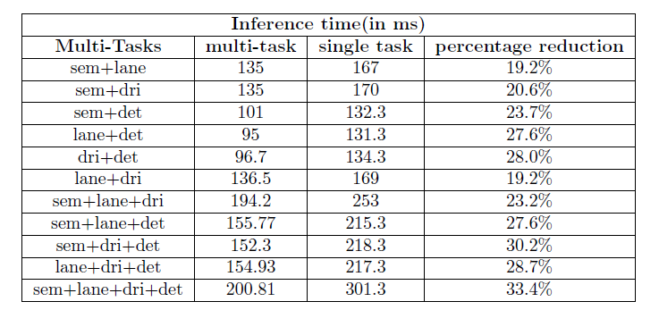

# Evaluation of Multi Vs. Single-task Neural Networks for Autonomous Driving Perception

A Multi-Task Neural Network (MTNN) enables a single network to solve multiple tasks simultaneously, offering efficiency
and performance improvements over Single-Task Neural Networks (STNNs). This thesis evaluates MTNNs against STNNs for
four autonomous driving perception tasks: semantic segmentation, lane marking, drivable area detection, and object
detection. Using the Audi Autonomous Driving Dataset (A2D2), we observe that MTNNs are up to 33% faster and achieve
higher accuracy across tasks compared to STNNs.

## Repository Overview

This repository contains the code, data preprocessing steps, and results for the thesis "Evaluation of Multi Vs.
Single-task Neural Networks for Autonomous Driving Perception." The project demonstrates the implementation of both
STNNs and MTNNs for autonomous driving perception tasks.

### Directory Structure
```
├── src/ # Python scripts for the project 
├── requirements.txt # List of Python dependencies 
├── README.md # Project documentation 
└── .gitignore # Files/folders to exclude from the repository
```

### Model Architecture

A shared trunk type multi-task model that solves semantic segmentation, lane marking,
drivable area, object detection tasks simultaneously.




## Features
 - Implementation of STNNs and MTNNs using PyTorch.
 - Tasks supported:
   - Semantic Segmentation
   - Lane Marking
   - Drivable Area Detection
   - Object Detection
 - Custom loss weighing and optimization techniques.
 - Training scripts and evaluation metrics for comparison.

### Prerequisites
- Python 3.8+
- CUDA-compatible GPU (optional, but recommended)

### Setup
1. Clone this repository:
   ```bash
   git clone https://github.com/yourusername/thesis-repo.git
   cd thesis-repo

Install the required dependencies:
 ```bash
 pip install -r requirements.txt
 ``` 


### Key findings from the thesis

Below is a summary of all studies conducted using MTNNs and their results. For a comprehensive analysis and detailed information, please refer to the full [thesis report](Thesis_report.pdf).

#### Accuracy

The accuracy of MTNN for all combinations is shown below. The green cells
represent an increase in accuracy for a single task in that multi-task combination, whereas the red
cells represent a decrease in accuracy. The deviation of each accuracy from its corresponding STNN
is indicated in brackets. The accuracy mentioned in bold indicates the maximum improvement
of that single task accuracy. The training stage from which the results are collected is shown in
the last column.



#### Inference time

- MTNNs are up to 33% faster in inference compared to STNNs. 
- Refer below table for detailed result.

  Inference time mentioned under single task is the sum of
inference time of individual task in the MTNN combination

#### Transfer learning capability

- Transfer learning with MTNN’s shared encoder improved STNN accuracy by up to 2%.
Contributing

