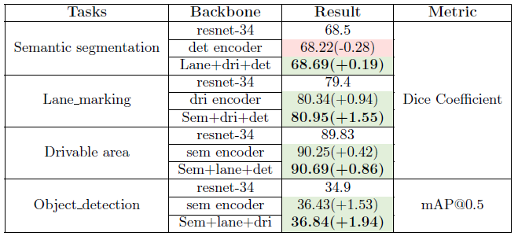
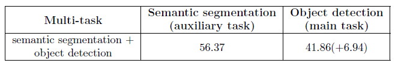
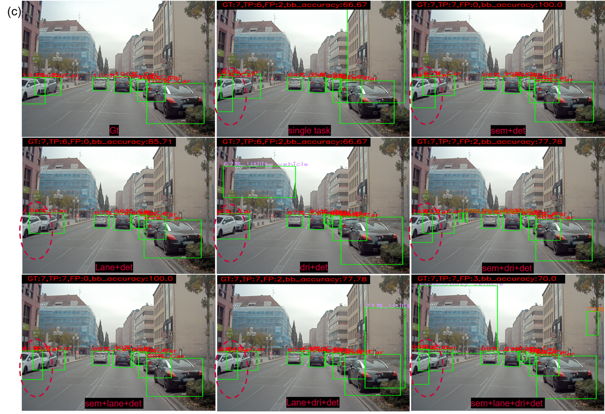
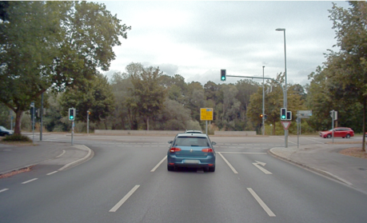
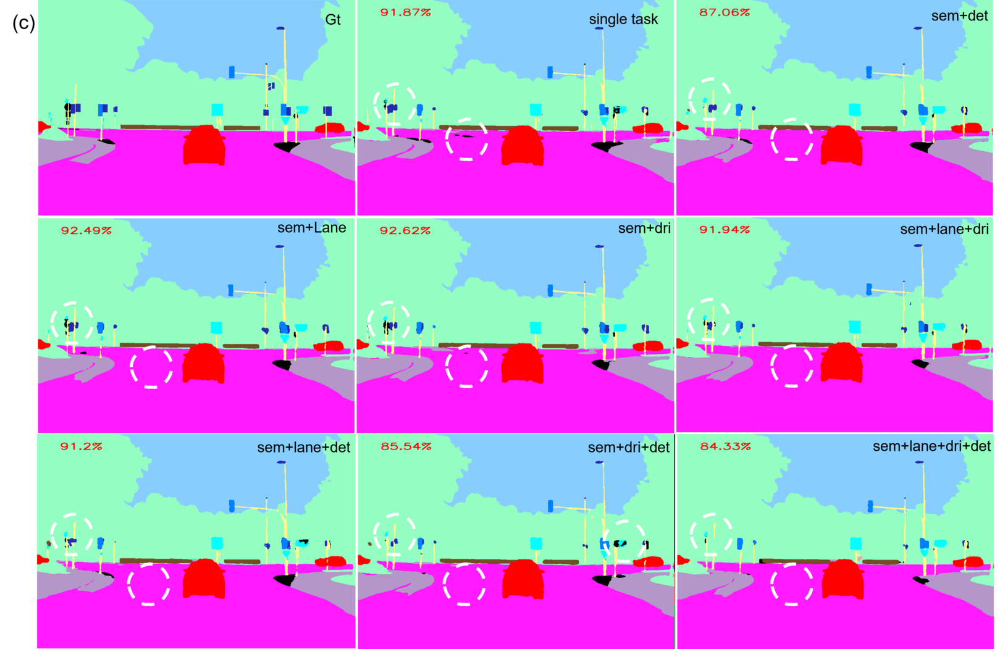
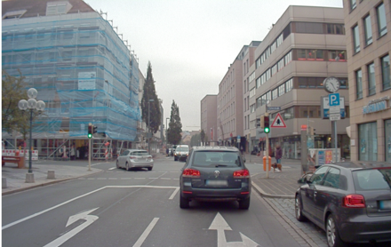

# Evaluation of Multi Vs. Single-task Neural Networks for Autonomous Driving Perception

A Multi-Task Neural Network (MTNN) enables a single network to solve multiple tasks simultaneously, offering efficiency
and performance improvements over Single-Task Neural Networks (STNNs). This thesis evaluates MTNNs against STNNs for
four autonomous driving perception tasks: semantic segmentation, lane marking, drivable area detection, and object
detection. Using the Audi Autonomous Driving Dataset (A2D2), we observe that MTNNs are up to 33% faster and achieve
higher accuracy across tasks compared to STNNs.

## Repository Overview

This repository contains the code, data preprocessing steps, and results for the thesis "Evaluation of Multi Vs.
Single-task Neural Networks for Autonomous Driving Perception." The project demonstrates the implementation of both
STNNs and MTNNs for autonomous driving perception tasks.

## Directory Structure

```
├── src/ # Python scripts for the project 
├── requirements.txt # List of Python dependencies 
├── README.md # Project documentation 
└── .gitignore # Files/folders to exclude from the repository
```

## Model Architecture

A shared trunk type multi-task model that solves semantic segmentation, lane marking, drivable area, object detection
tasks simultaneously.


## Features

- Implementation of STNNs and MTNNs using PyTorch.
- Tasks supported:
    - Semantic Segmentation
    - Lane Marking
    - Drivable Area Detection
    - Object Detection
- Custom loss weighing and optimization techniques.
- Training scripts and evaluation metrics for comparison.

## Prerequisites

- Python 3.8+
- CUDA-compatible GPU (optional, but recommended)

## Setup and Usage

1. Clone this repository:
   ```bash
   git clone https://github.com/yourusername/thesis-repo.git
   cd thesis-repo

2. Install the required dependencies:
   ```bash
   pip install -r requirements.txt
   ``` 

3. Modify the hyperparameters in the [train.py](src/train.py).
4. Create your train.csv and test.csv (refer [example](src/sample_csv/sample.csv)) for dataloader.
5. Run train.py.

## Key findings from the thesis

Below is a summary of all studies conducted using MTNNs and their results. For a comprehensive analysis and detailed
information, please refer to the full [thesis report](Thesis_report.pdf).

### Accuracy

The accuracy of MTNN for all combinations is shown below. The green cells represent an increase in accuracy for a single
task in that multi-task combination, whereas the red cells represent a decrease in accuracy. The deviation of each
accuracy from its corresponding STNN is indicated in brackets. The accuracy mentioned in bold indicates the maximum
improvement of that single task accuracy. The training stage from which the results are collected is shown in the last
column.


### Inference time

- MTNNs are up to 33% faster in inference compared to STNNs.
- Refer below table for detailed result.


Inference time mentioned under single task is the sum of inference time of individual task in the MTNN combination

### Transfer learning capability

- The shared encoder in MTNNs significantly enhances the accuracy of STNNs through transfer learning.
- Below table 12 the performance of each STNN when trained with two new backbones. One is from an STNN and the other one
  is from an MTNN. The pre-trained encoder is selected such that its original task is similar to the current task. And
  the MTNN shared encoder is simply the one that handles the other three primary tasks except for the current one. The
  results show that each task’s accuracy improves the most when MTNN’s shared encoder weights are used.



The cells in red indicate that the accuracy is lower compared to STTN’s accuracy when trained with the resnet-34
backbone. And the green cells indicate an increase in the accuracy of that backbone. In brackets, the deviation of each
accuracy from its corresponding STNN with resnet- 34 backbone is indicated.

### Semantic-segmentation as an auxiliary task

The idea behind this approach is to enhance the performance of a single primary task by leveraging an auxiliary task
within a Multi-Task Neural Network (MTNN). In this case, semantic segmentation is used as an auxiliary task to improve
the primary task of object detection. Since the dataset lacks labels for semantic segmentation, they are generated using
a pre-trained Single-Task Neural Network (STNN), such as DeepLabv3, trained on related datasets like CityScapes and BDD.
By integrating these generated labels, the method demonstrates that adding the auxiliary task of semantic segmentation
can boost the overall performance and generalization of the MTNN, leading to improved results in the object detection
task. Similarly, this method can be applied to improve other primary tasks as well.

Refer below table for the experiment results.



### Prediction results

- Below are the prediction results comparing the performance of the single-task model with its performance in various
  combinations of Multi-Task Neural Network (MTNN) training.

#### Object detection 



#### Semantic segmentation





#### Lane marking




